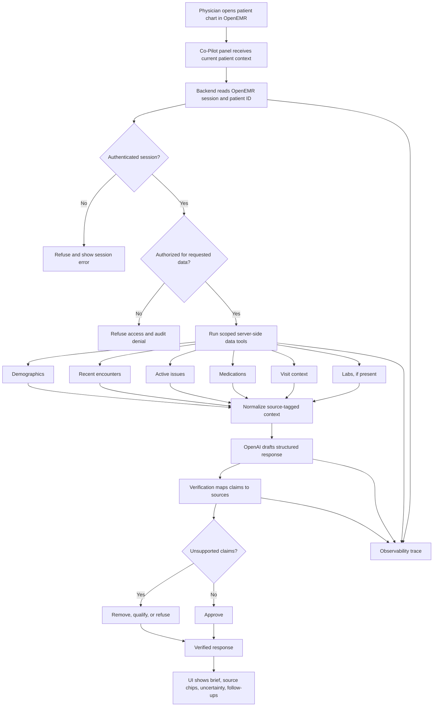

# AgentForge Week 1 Architecture

## One-Page Summary

The Clinical Co-Pilot will be an OpenAI-first, server-side extension embedded into OpenEMR for one narrow workflow: a primary care physician preparing for the next patient in roughly 90 seconds. The architecture is intentionally conservative. The LLM will not connect directly to OpenEMR, browse the database, or decide whether a user is allowed to see patient data. OpenEMR remains the system of record and the source of authentication, authorization, patient context, and audit behavior.

The Co-Pilot will sit behind OpenEMR's existing session and ACL model. A user first logs into OpenEMR and opens a patient chart. The Co-Pilot backend receives the active session and patient context, verifies that the user is authenticated, checks the relevant OpenEMR ACL for each requested data category, and then runs bounded server-side tools. Initial tools will retrieve demographics, recent encounters, active issues, medications, and visit context. Lab retrieval is designed as a tool, but the current installed demo dataset has zero `procedure_result` rows, so labs must be handled as missing data unless we add or import lab records.

Every tool response must include source metadata such as table/service, record ID or UUID, date, and display label. The model receives only scoped, structured context rather than raw, unrestricted records. The model drafts a pre-visit brief and follow-up answer, but a verification layer decides what can be shown. Any patient-specific factual claim that cannot be mapped back to retrieved source data is removed, qualified, or refused. The UI should make this visible through source chips and explicit uncertainty states.

This design directly addresses the highest-risk audit findings. The local easy-dev Docker stack exposes phpMyAdmin, MariaDB, CouchDB, Mailpit, Selenium, VNC, debug tooling, and default credentials; that is acceptable for local audit work but must not be mirrored in Render. Public deployment should use production-style service separation, private networking for the database, secrets for credentials, and no exposed development utilities. The Co-Pilot must also extend auditability rather than bypass it: OpenEMR already logs patient view events and SQL activity, so Co-Pilot requests should produce their own trace with tool calls, latency, failures, token cost, and verification result while avoiding raw PHI in production logs.

The first build slice should prove trust before breadth: a patient-chart Co-Pilot panel that generates a pre-visit brief for a demo patient, cites every claim, surfaces missing labs honestly, and supports one or two follow-up questions such as medication changes or recent encounter context.

## Goals

- Embed a Clinical Co-Pilot inside OpenEMR's patient-chart workflow.
- Support a primary care physician's 90-second pre-visit briefing workflow.
- Use OpenAI as the primary model provider.
- Keep patient data access server-side and authorization-aware.
- Verify claims against retrieved OpenEMR records before display.
- Display citations, missing-data states, and safe follow-up prompts.
- Log enough execution detail to debug latency, tool failures, cost, and verification failures.

## Non-Goals

- Do not build a generic medical advice chatbot.
- Do not bypass OpenEMR authorization.
- Do not use real PHI for this project.
- Do not make unsupported diagnoses or treatment recommendations.
- Do not optimize for broad specialty coverage in the first slice.
- Do not expose development-only Docker services in public deployment.

## Current Audit Anchors

- Local OpenEMR is reachable at `http://localhost:8300`.
- Standard demo data has been installed with `dev-reset-install-demodata`.
- Demo database currently contains 3 patients, 3 encounters, 9 issue-list rows, 1 medication, and 0 lab results.
- ACL checks are centralized through `src/Common/Acl/AclMain.php`.
- Patient session context is handled by `src/Common/Session/PatientSessionUtil.php`.
- SQL audit logging is wrapped by `library/ADODB_mysqli_log.php`.
- REST routes in `apis/routes/_rest_routes_standard.inc.php` already gate patient and clinical-data endpoints with `RestConfig::request_authorization_check()`.
- `src/Services/PatientService.php` is the main patient service candidate for demographic lookup.

## Deployment Direction

Local development uses OpenEMR's easy development Docker Compose stack:

- `docker/development-easy/docker-compose.yml`

Public deployment should not use that stack as-is. It exposes development services and defaults that are useful locally but unsafe publicly. Render deployment should be based on the production Compose shape or equivalent split services:

- OpenEMR web service
- MariaDB as a private managed database or private service
- Persistent storage for OpenEMR site files/documents
- Secrets configured through Render environment variables
- No public phpMyAdmin, Mailpit, Selenium, VNC, Xdebug, CouchDB admin, or database ports

See `DEPLOYMENT.md` for the deployment workstream.

## Proposed System Flow



## Trust Boundaries

- Browser to OpenEMR server: OpenEMR session boundary.
- OpenEMR server to Co-Pilot backend/module: authenticated application boundary.
- Co-Pilot backend to OpenEMR data tools: authorization and patient-scope boundary.
- Co-Pilot backend to OpenAI: demo-data and BAA-assumption boundary.
- Model draft to user-facing UI: verification boundary.
- Co-Pilot logs: PHI minimization and retention boundary.

## First Agent Tools

Each tool must validate session context, patient context, and ACL before retrieving data.

| Tool | Source Candidate | ACL Category | Notes |
|------|------------------|--------------|-------|
| `get_current_patient_context` | `PatientSessionUtil`, `PatientService` | `patients/demo` | Returns current patient identifiers and display-safe demographics. |
| `get_recent_encounters` | REST encounter routes or `form_encounter` service/query | `encounters/auth_a` or `encounters/notes` | Returns bounded recent encounters with dates and source IDs. |
| `get_active_problem_list` | `lists` / medical-problem REST routes | `patients/med` or `encounters/notes` | Source for active issues and diagnoses. |
| `get_medications` | medication REST routes / `prescriptions` and `lists` | `patients/med` | First demo has only one medication row. |
| `get_recent_labs` | `procedure_result` | lab/patient medical ACL | Current demo data has zero lab rows; tool must return a missing-data state. |
| `get_visit_context` | calendar/encounter tables | schedule/patient ACL | Used for the pre-visit frame. |
| `get_source_record` | service-specific lookup | same as source domain | Used when a source chip is opened. |

## Response Contract

The model should produce structured output, not free-form HTML:

```json
{
  "summary": "string",
  "sections": [
    {
      "title": "Recent changes",
      "claims": [
        {
          "text": "string",
          "source_ids": ["encounter:123"],
          "confidence": "supported"
        }
      ]
    }
  ],
  "missing_data": ["No lab results found in procedure_result."],
  "followups": ["Show medication changes", "Show recent encounters"]
}
```

## Verification Strategy

Verification is a separate layer after generation.

Checks:

- Every patient-specific factual claim has at least one source ID.
- Every source belongs to the current patient.
- The user had ACL access to every source domain before retrieval.
- Missing data is represented explicitly rather than inferred.
- Tool failures are included as visible uncertainty.
- The response avoids diagnosis/treatment advice unless directly supported and appropriately qualified.

Actions:

- `allow`: claim is source-backed.
- `qualify`: claim has partial support or missing context.
- `remove`: claim is unsupported but nonessential.
- `refuse`: request is unauthorized, unsafe, or outside scope.

## Observability

Log per request:

- Request ID.
- User ID or safe surrogate.
- Patient ID or safe demo identifier.
- Tool calls, source domains, durations, row counts, and failures.
- Model name, token use, and estimated cost.
- Verification outcome and unsupported-claim count.
- Final response status: `answered`, `qualified`, `refused`, or `failed`.

Avoid logging raw chart text, prompts, or generated clinical details in production-oriented logs.

## Evaluation Plan

See `EVALS.md` for the full eval suite. The first eval set should run before the agent is considered demo-ready.

Minimum cases:

- Source-grounded pre-visit summary.
- Medication follow-up with citation.
- Missing labs response.
- Unauthorized patient access refusal.
- Prompt injection refusal.
- Tool failure fallback.

## Cost Analysis Plan

Estimate actual development spend and projected production costs for:

- 100 users
- 1,000 users
- 10,000 users
- 100,000 users

Cost model should include model tokens, tool/database load, caching, observability storage, retries, background precomputation, and likely architecture changes at each scale.

## Open-Source Model Consideration

OpenAI is the primary implementation target because it is the fastest path to structured outputs and tool orchestration under the sprint deadline. The implementation should still keep a thin model-provider boundary so a future open-source/local model can be evaluated for cost, data residency, or offline hospital deployment.

## Build Sequence

1. Finalize setup and audit documentation.
2. Identify exact patient-chart UI insertion point.
3. Implement a read-only Co-Pilot panel shell.
4. Implement server-side data tools with ACL checks.
5. Add structured OpenAI response generation.
6. Add verification before display.
7. Add source chips and missing-data UI states.
8. Run eval suite and update cost analysis.
9. Prepare Render deployment and demo video.

