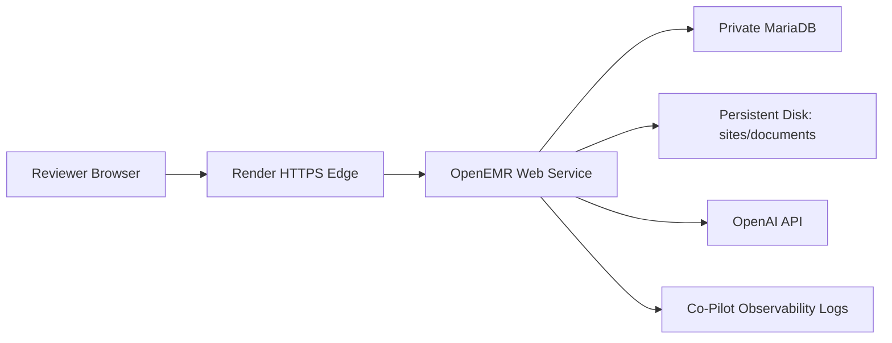

# AgentForge Deployment Plan

## Goal

Deploy the OpenEMR fork publicly for Gauntlet submissions while keeping development-only services and credentials out of the public surface.

## Local Development

Use the easy development Docker Compose stack:

```powershell
cd C:\Users\jayce\OneDrive\Documents\OpenEMR\docker\development-easy
docker compose up -d
docker compose exec -T openemr /root/devtools dev-reset-install-demodata
docker compose restart couchdb
```

Local URLs:

- OpenEMR: `http://localhost:8300`
- HTTPS OpenEMR: `https://localhost:9300`
- phpMyAdmin: `http://localhost:8310`
- Mailpit: `http://localhost:8025`

Local credentials:

- OpenEMR: `admin / pass`

These defaults are for local demo data only.

## Public Deployment Constraints

Do not expose:

- phpMyAdmin
- MariaDB public port
- CouchDB admin ports
- Mailpit
- Selenium
- VNC
- Xdebug
- default `admin/pass`
- committed database or API credentials

## Render Direction

Render likely needs a production-style split rather than the easy-dev Compose stack:

1. OpenEMR web service.
2. Private MariaDB-compatible database service or managed external database.
3. Persistent disk for `sites/` and documents.
4. Environment variables for all credentials.
5. HTTPS through Render edge.
6. Healthcheck against OpenEMR readiness endpoint.

## Candidate Topology



## Environment Variables

Required or likely required:

- `MYSQL_HOST`
- `MYSQL_ROOT_PASS`
- `MYSQL_USER`
- `MYSQL_PASS`
- `OE_USER`
- `OE_PASS`
- `OPENAI_API_KEY`
- `COPILOT_MODEL`
- `COPILOT_LOG_LEVEL`
- `COPILOT_DISABLE_RAW_PHI_LOGS=true`

## Deployment Risks

| Risk | Impact | Mitigation |
|------|--------|------------|
| Compose does not map cleanly to Render. | Public deployment delays. | Split web, DB, and persistent storage services. |
| Persistent files are lost on redeploy. | OpenEMR site config/documents disappear. | Use Render persistent disk or equivalent volume strategy. |
| Default credentials remain active. | Public admin compromise. | Force unique secrets before public URL submission. |
| Dev services are exposed. | PHI/data leakage risk. | Use production topology, not easy-dev Compose. |
| Cold start is slow. | Demo unreliability. | Warm the app before recording/submission. |

## Submission Checklist

- [ ] Public URL loads.
- [ ] Default credentials changed.
- [ ] Demo data only.
- [ ] No phpMyAdmin/Mailpit/Selenium/VNC public ports.
- [ ] Co-Pilot environment variables configured.
- [ ] Healthcheck documented.
- [ ] README includes deployed link.

