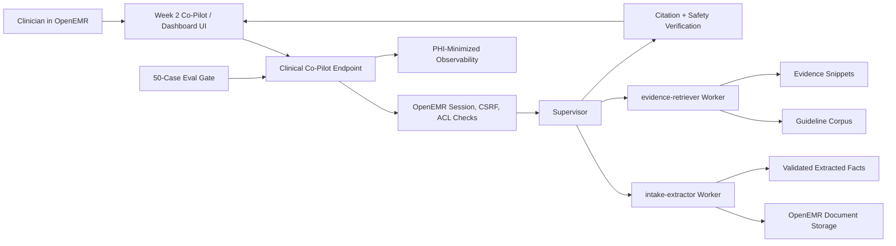

# AgentForge Week 2 Architecture

## Summary

Week 2 extends the Week 1 Clinical Co-Pilot in two directions: multimodal document evidence and an inspectable agent graph. The architecture should remain conservative. OpenEMR stays the system of record, and the Co-Pilot still cannot bypass OpenEMR authentication, authorization, patient scoping, or audit expectations.

The new core capability is document-grounded clinical evidence. A source document, such as a lab PDF or intake form, is attached to a patient, stored in OpenEMR, parsed into strict JSON, and transformed into derived facts only when the extraction is valid and cited. Every extracted field carries citation metadata so the UI and evals can trace it back to the original document. Unsupported extracted fields are shown as uncertain or rejected rather than silently promoted into patient facts.

The answer path separates patient facts from guideline evidence. Patient facts come from OpenEMR structured data and attached documents. Guideline evidence comes from a small primary-care corpus indexed with hybrid retrieval. The answer model receives only validated patient facts and top reranked evidence chunks. Final clinical claims must cite either a patient source, a guideline source, or both, depending on the claim type.

The agent graph should be intentionally small: one supervisor and two workers. The supervisor decides whether extraction is needed, whether evidence retrieval is needed, and whether the final answer is ready. The `intake-extractor` worker handles document parsing and schema validation. The `evidence-retriever` worker handles hybrid search, reranking, and evidence snippet assembly. Handoffs are logged as structured events with timestamps, input references, output references, confidence, and error state. A critic agent is useful extension work, but Week 2 core can use deterministic validation and citation gates before adding another model actor.

Eval-driven CI is the hard gate. A 50-case golden set should cover schema validity, citation presence, factual consistency, safe refusal, missing-data behavior, retrieval relevance, and no raw PHI in logs. CI must fail when meaningful regression appears. This matters more than a glossy demo because the Week 2 grader may intentionally introduce a regression and expect the gate to catch it.

## Components



## Document Ingestion

Target tool:

```text
attach_and_extract(patient_id, file_path, doc_type)
```

Supported `doc_type` values:

- `lab_pdf`
- `intake_form`

The tool must:

- Require authenticated OpenEMR session context.
- Verify patient access before reading or writing.
- Store the source document in OpenEMR or an OpenEMR-linked document location.
- Extract strict-schema JSON.
- Persist derived facts only when valid, cited, and traceable.
- Return missing/uncertain fields explicitly.
- Avoid logging raw document text or screenshots.

## Citation Contract

Minimum citation shape:

```json
{
  "source_type": "openemr_document | openemr_record | guideline",
  "source_id": "string",
  "page_or_section": "string",
  "field_or_chunk_id": "string",
  "quote_or_value": "string"
}
```

Week 2 requires visual PDF bounding-box overlays. The implementation should store page number and bounding box coordinates for extracted document facts when the extractor can provide them. If bounding boxes are unavailable, the UI should mark that source as text-cited but not overlay-ready.

## Schemas

`lab_pdf` required fields:

- test name
- value
- unit
- reference range
- collection date
- abnormal flag
- source citation

`intake_form` required fields:

- demographics fields
- chief concern
- current medications
- allergies
- family history
- source citation

## Hybrid RAG

Initial corpus should be small and primary-care specific:

- A1C / diabetes monitoring
- Blood pressure / hypertension follow-up
- Medication reconciliation
- Allergy safety

Retrieval design:

1. Normalize clinician question and extracted patient facts into a query.
2. Run sparse keyword search over guideline chunks.
3. Run dense vector search over the same corpus.
4. Merge candidates.
5. Rerank candidates with Cohere Rerank or an equivalent reranker.
6. Pass only top grounded snippets to the answer model.

## Observability

Each request should log:

- request id
- user id
- patient id
- ACL result
- tool sequence
- supervisor route decision
- worker handoffs
- latency by step
- model name
- token usage when available
- cost estimate
- retrieval hits
- extraction confidence
- validation result
- eval outcome when running evals

Logs must not contain raw PHI, full prompts, document text, or screenshots.

## Eval Gate

Boolean rubric categories:

- `schema_valid`
- `citation_present`
- `factually_consistent`
- `safe_refusal`
- `missing_data_explicit`
- `retrieval_relevant`
- `no_phi_in_logs`

The gate should fail if any category drops below threshold or regresses by more than 5%.

## Tradeoffs

- A small graph is less flashy than a multi-agent swarm, but easier to inspect and defend.
- Local/open-source models may become useful later, but OpenAI-compatible structured output remains the fastest path for the sprint.
- The modern dashboard should be narrow enough to finish while preserving parity for the required cards.
- Visual bounding boxes are required, but source-cited extraction should land first so the data contract is stable.
